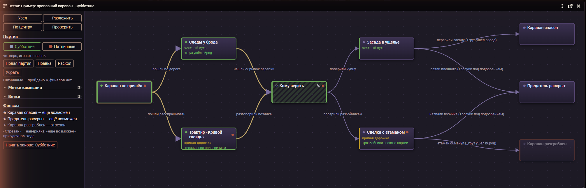
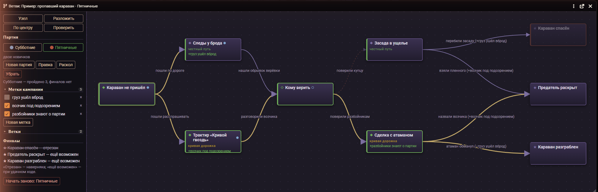

# UO · Ветви сценария

Чертёж кампании для Foundry VTT: узлы, развилки, метки и финалы. Ведущий пишет,
что на что выводит, отмечает случившееся — и видит, какие финалы ещё в игре,
а какие партия уже отрезала.



Кампанию с развилками держат обычно в голове или в блокноте: «пощадят барона —
выйдет мир, казнят — война». Пока развилок три, это работает. К десятой уже
не помнишь, какие концовки партия отрезала во втором акте, а какие ещё живы.

## Установка

В Foundry, в окне установки модулей: **«Установить модуль»**, внизу окна
вставить адрес манифеста:

```
https://github.com/Nikifour/uo-vetvi/releases/latest/download/module.json
```

Дальше модуль обновляется сам. Foundry **v13–v14**, система любая, сторонних
модулей не нужно. Граф видят только ведущие.

Справка едет вместе с модулем — компендиум «Ветви сценария · Как пользоваться»,
по-русски и по-английски.

## Что умеет

**Сценарий — это журнал.** Узел — страница, текст пишется штатным редактором,
ссылки на сцены и актёров работают сами. Модуль добавляет к журналу только
стрелки, метки и ход кампании. Уберёте модуль — останется обычный журнал.
Сделать сценарием можно любой журнал: правой кнопкой — «Ветви: сделать сценарием».

**Вид узла — не украшение.** **◆ Сцена** остаётся открытой: к брошенной зацепке
можно вернуться через месяц. **◇ Развилка** захлопывается: пройден один выход —
остальные закрыты навсегда. **★ Финал** — итог, который считается.

**Метки кампании.** Короткие факты о мире: «барон жив», «печать сломана». Узел
метки ставит и снимает, стрелка их требует. За столом случается всякое, поэтому
метку можно переключить и руками.

**Финалы.** Каждый помечен: **состоялся**, **ещё возможен** или **отрезан**.
Отрезанное отрезано наверняка, а «ещё возможен» значит «при удачном стечении»:
обещать больше было бы враньём.

**Разбор написанного.** Кнопка «Проверить» находит узлы без дороги от начала,
тупики, метки ниоткуда и финалы, из которых что-то выходит. Сценарий проверяется
до партии, а не за столом.

**Несколько партий по одному сценарию.** Схема общая, ход у каждой свой: добавил
узел — он появился у всех, отметил пройденное — только у той компании, что сейчас
выбрана. На карточках узлов — цветные точки партий, которые здесь уже были.
«Раскол» заводит партию, перенявшую ход текущей, когда половина игроков ушла
своим путём.



**Сценарий из компендиума обновляется, не теряя пройденного.** «Ветви: обновить
из компендиума» приносит свежую схему в уже идущую кампанию: отмеченные узлы
и поднятые метки остаются на месте.

## Из макросов

```js
UOVetvi.panel()                               // список сценариев
UOVetvi.open("Пропавший караван")             // открыть граф
UOVetvi.endings("Пропавший караван")          // финалы: состоялся / возможен / отрезан
UOVetvi.check("Пропавший караван")            // разбор написанного
UOVetvi.parties.list("Пропавший караван")     // партии сценария
```

## Поддержать

Модуль бесплатный. Новости о выходе инструментов и разборы того, как они
устроены, — на Boosty: **[boosty.to/unshaved_orange](https://boosty.to/unshaved_orange)**.
Там же можно сказать спасибо.

Ошибки и пожелания — в [Issues](https://github.com/Nikifour/uo-vetvi/issues).

## Лицензия

Скачать и поставить может каждый; пользоваться в своих играх — как угодно,
включая платные и в прямой передаче. Выкладывать модуль где-либо ещё,
продавать и включать в чужие сборки нельзя. Все права за автором.
Полный текст — в [LICENSE](LICENSE).

---

## In English

**Scenario Branches** is a campaign map for Foundry VTT: nodes, forks, campaign
flags and endings. Mark what happened and see which endings are still possible
and which your party has already cut off. Several parties can run the same
scenario with their own progress. The interface follows Foundry's language
(Russian and English); an English guide ships as a compendium.

Install with the manifest URL:
`https://github.com/Nikifour/uo-vetvi/releases/latest/download/module.json`

## Язык

Модуль говорит на языке, выбранном в Foundry: русский в исходнике, английский
словарём `lang/en.json`. Ключ словаря — сама русская фраза, как в gettext:
непереведённое не превращается в пустоту, а остаётся русским.
